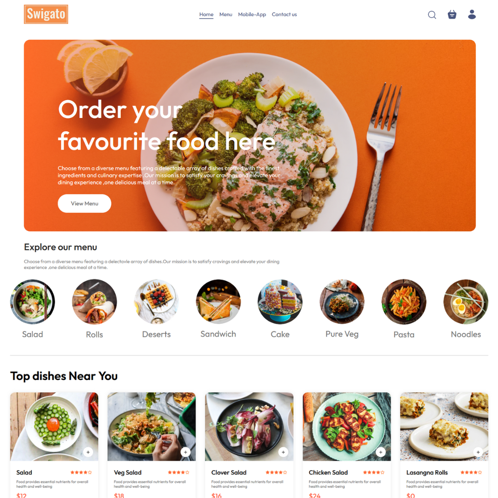

# Swigato Food Delivery Platform [Website Link](https://food-delivery-app-frontend-krqb.onrender.com/)

## Project Description

Swigato is a fully functional online food delivery platform that enables users to browse, and order food from various restaurants. The platform is built using the MERN stack, which includes ReactJS, NodeJS, MongoDB, and ExpressJS.

Swigato aims to provide:
- A seamless and efficient food ordering experience for users.
- A platform for restaurants to showcase their menus and reach a wider audience.

In the following sections, we will cover the technical details of the platform, including:
1. System Architecture
2. Front-end
3. Back-end
4. API Design
5. Deployment
6. Testing
7. Future Enhancements

In summary, Swigato is designed to offer an intuitive and user-friendly experience for both customers and restaurant owners. The following sections provide a comprehensive overview of the platform's features and functionalities.

## System Architecture

Swigato consists of three main components: the front end, the back end, and the database. The platform follows a client-server architecture, with the front end serving as the client and the back end and database serving as the server.

### Front-end

The front end of the platform is built using ReactJS, which allows for the creation of dynamic and responsive user interfaces. The front end communicates with the back end using RESTful API calls.

### Back-end

The back end of the platform is built using NodeJS and ExpressJS. The back end provides APIs for the front end to consume, which include functionalities such as user authentication, order processing, and restaurant management. The back end also handles the logic for processing and storing user data and orders.

### Database

The database for the platform is built using MongoDB, which is a NoSQL database that provides a flexible and scalable data storage solution. MongoDB stores the menu items, user data, orders, and other relevant information.

### Architecture Diagram

Here is a high-level diagram that illustrates the architecture of the Swigato platform:

## Front End

The front end of Swigato includes all the necessary pages that a food delivery platform should have. Some of these pages are:

### For Users:
- **Homepage**: This page provides an overview of the platform and various dishes. 
- **Menu**: This page lists all the available dishes along with their price.
- **Cart**: This page allows users to review their selected items before placing an order.
- **Order**: This page shows the user's orders.

### For Restaurants Admin's:
- **Menu Management**: This section includes:
    - Add Menu Item: Allows the restaurant to add new menu items, including uploading images, setting names, descriptions, prices, and categories.
    - List Menu Items: Displays all current menu items with options to view, update, and delete items.
- **Order Management**: This page allows the restaurant to view and manage current orders.

To build the front end, we use frameworks and libraries such as ReactJS, and CSS for styling. To manage the state of the application we use React's built-in state management system.

## Back End

### Description of the Back-end Architecture

Swigato uses a monolithic architecture with the backend built using Node.js and Express.js, and MongoDB as the primary database.

### Features and Functionalities of the Back-end

The back end of Swigato provides a range of features and functionalities, including:
1. **User authentication and authorization**: Users and restaurants can sign up and log in to the platform using their email addresses and passwords. The platform supports JWT for secure authentication.
2. **Order management**: Users can create, read, update, and delete orders, as well as manage order statuses.
3. **Menu management**: Restaurants can create, read, update, and delete menu items.
4. **Payment integration**: The platform integrates with payment gateways for handling transactions.

### Frameworks, Libraries, and Tools used

The back end of Swigato uses a range of frameworks, libraries, and tools to ensure its functionality and performance, including:
- **Node.js**: Used as the primary framework for the back end.
- **MongoDB**: Used as the primary database.
- **Express.js**: Used as a web application framework.
- **JWT**: Used for authentication and authorization.
- **Bcrypt**: Used for password hashing.
- **Mongoose**: Used as an ODM library for MongoDB.

### Data Models and Database Schema

The back end of Swigato uses a range of data models and database schemas to manage data, including:
- **User schema**: Includes fields such as name, email, password, and order details.
- **Order schema**: Includes fields such as user details, address details, items ordered, and order status.
- **Food schema**: Includes fields such as food item name, description, price, category and image.

## API Design

The Swigato platform's API is designed following the REST architectural style. The API is implemented using Node.js and Express.js. It uses JSON for data exchange and follows standard HTTP request methods such as GET, POST, PUT, and DELETE.

### Sample list of API endpoints and their functionalities:
1. **`/api/auth/register` (POST)** - Create a new user (customer) account.
2. **`/api/auth/login` (POST)** – Log in using existing credentials and generate a JWT token.
3. **`/api/cart/add` (POST)** - Add an item to the user's cart.
4. **`/api/cart/remove` (POST)** - Remove an item from the user's cart.
5. **`/api/cart/get` (POST)** - Retrieve the user's cart data.
6. **`/api/food/add` (POST)** - Add a new food item with an image upload.
7. **`/api/food/list` (GET)** - Get a list of all food items.
8. **`/api/food/remove` (POST)** - Remove a food item by ID, including its image from the uploads folder.
9. **`/api/orders/list` (GET)** - Get a list of all orders for the admin panel.
10. **`/api/orders/userorders` (POST)** - Get a list of orders for a specific user by user ID.
11. **`/api/orders/place` (POST)** - Create a new order and initiate a payment session with Stripe.
12. **`/api/orders/verify` (POST)** - Verify the payment status of an order.
13. **`/api/orders/status` (POST)** - Update the status of an existing order by order ID.

### Sample API requests and responses:

1. **GET `/api/food/list`**: Get a list of all food items
   * Response: A list of all food items in the database
2. **GET `/api/orders/list`**: Get a list of all orders 
   * Response: The list with the specified user's ID
3. **POST `/api/food/add`**: Create a new food item
   * Request: The food details in the request body
   * Response: The newly created food Item

In conclusion, the REST API design for the Swigato platform is a crucial part of the project. The API endpoints and their functionalities are designed to ensure seamless communication between the front-end and back-end of the application. By following RESTful principles, the API will be scalable, maintainable, and reliable. The sample API requests and responses provided above illustrate how each endpoint will function and what kind of data it will accept or return. With this API design, Swigato will be able to provide a smooth user experience while ensuring security and stability.

## Future Enhancements

Potential future enhancements to the platform could include:
1. **Mobile App**: Develop a mobile app for Android and iOS platforms.
2. **Advanced Analytics**: Provide advanced analytics and reporting for restaurants.
3. **AI-based Recommendations**: Implement AI-based recommendation systems for personalized user experiences.
4. **Multi-language Support**: Add support for multiple languages to cater to a wider audience.
5. **Subscription Plans**: Introduce subscription plans for premium features.

These enhancements would improve the platform by providing additional functionalities, enhancing user experience, and expanding the platform's reach. Estimated timelines and priorities for implementing these enhancements will be provided based on project planning.
